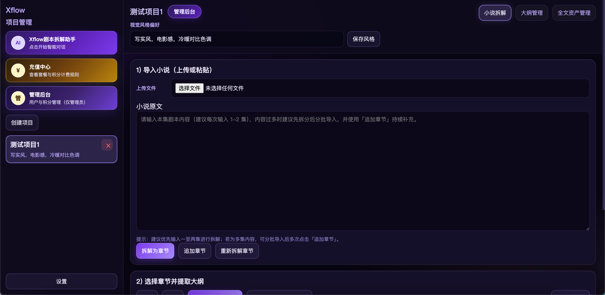
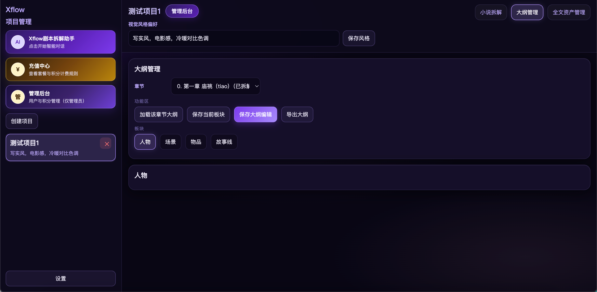
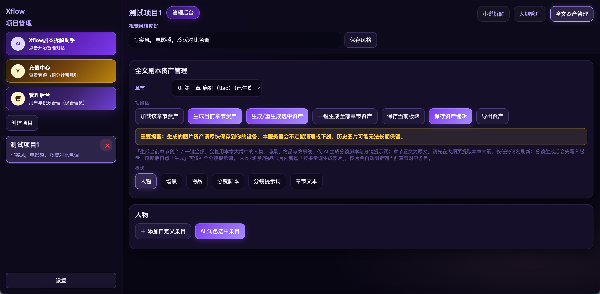
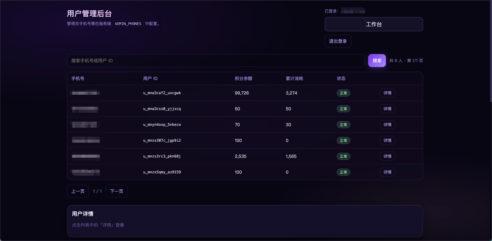

# Xflow 📖 → 🎬

> 让漫剧制作变简单 —— 一站式 **小说转漫剧/短剧** AI 创作工作台。

Xflow 是一个轻量化漫剧制作与资产管理平台：上传小说 → 拆解章节 → 提取大纲（人物 / 场景 / 物品 / 故事线）→ 生成分镜脚本与逐镜提示词 → AI 生成分镜图。从小说拆解、章节大纲到分镜与图像资产，一个工作台完成全流程漫剧创作。

## ✨ 核心特性

- **📚 小说拆解** —— 上传 txt 或直接粘贴文本，自动按章拆解，支持追加章节、重新拆解
- **🗂️ 大纲管理** —— AI 提取章节大纲，按「人物 / 场景 / 物品 / 故事线」分板块管理，支持加载、编辑、导出
- **🎨 全文资产管理** —— 基于本大纲的人物、场景、物品与故事线生成资产提示词，支持生成分镜提示词、分镜生图，资产可编辑、保存、导出
- **🖼️ AI 生图** —— 内置多模型生图管线，人物/场景/物品卡可生成示意图，分镜提示词可一键生成分镜图
- **🧩 视觉风格锚定** —— 项目级「视觉风格偏好」（如「写实风，电影感，冷硬对比色调」）贯穿提示词生成链路，自动校正风格冲突词
- **👤 多用户 & 积分** —— 手机号注册登录、积分计费与用量统计、管理后台用户管理

## 🖼️ 界面预览

### 登录页


### 工作台 · 小说拆解

导入小说（上传或粘贴），拆解为章节后选择章节提取大纲：



### 大纲管理

按章节加载大纲，人物 / 场景 / 物品 / 故事线分板块编辑与导出：



### 全文资产管理

生成当前章节资产、一键生成全部章节资产，人物 / 场景 / 物品 / 分镜脚本 / 分镜提示词 / 章节文本全维度管理：



### 管理后台

用户管理、积分余额与消耗统计（管理员通过 `ADMIN_PHONES` 配置）：



## 🏗️ 技术架构

```
┌──────────────────────────────────────────────────┐
│  前端：原生 HTML/JS 单页                           │
│   index · workspace · admin · login               │
├──────────────────────────────────────────────────┤
│  后端：Node.js + Express                          │
│   ├── server.js        主服务（用户/积分/工作台）  │
│   ├── src/ (TypeScript) 创作管线                  │
│   │   ├── routes/      project·novel·outline·     │
│   │   │                script·storyboard·assets·  │
│   │   │                prompt·video·task·user     │
│   │   ├── agents/      outlineScript·storyboard   │
│   │   └── services/    fullAssetPipeline          │
├──────────────────────────────────────────────────┤
│  存储：SQLite（用户/积分） · MongoDB（业务数据）   │
│  队列：Redis + BullMQ（异步生成任务）              │
│  AI  ：OpenAI 兼容 LLM + 多模型生图 API            │
└──────────────────────────────────────────────────┘
```

**端到端创作管线**：

```
小说文本 → 章节拆解 → 大纲提取（人物/场景/物品/故事线）
        → 全文资产（提示词生成与润色）
        → 分镜脚本 → 逐镜提示词 → AI 生图
```

提示词链路内置三步后处理：**净化**（剔除模型误输出的模板标签）→ **二次润色**（依据人物外貌/场景环境生成可执行提示词）→ **风格强制校正**（按项目视觉风格剔除冲突词，如 2D 动漫风自动移除「写实摄影 / 35mm / 浅景深」等）。

## 🚀 本地部署

### 环境要求

- Node.js ≥ 18
- Redis（任务队列）
- MongoDB（业务数据）
- 一个 OpenAI 兼容的 LLM API Key（官方 API 或任意中转站均可）

### 安装与启动

```bash
# 1. 安装依赖
npm install

# 2. 配置环境变量
cp .env.example .env
# 编辑 .env，至少填写 OPENAI_API_KEY

# 3. 启动
npm run dev

# 4. 打开浏览器
# http://localhost:3200
```

### 关键环境变量

| 变量 | 说明 | 必填 |
|---|---|---|
| `OPENAI_API_KEY` | OpenAI 兼容 API Key | ✅ |
| `OPENAI_BASE_URL` | LLM 网关地址（支持中转站） | ❌ |
| `OPENAI_MODEL` | 主模型 | ❌ |
| `TOAPIS_API_KEY` | 生图 API Key（资产/分镜出图） | 出图必填 |
| `SESSION_SECRET` | 会话加密密钥，生产环境务必修改 | ❌ |
| `ADMIN_PHONES` | 管理员手机号白名单（逗号分隔） | ❌ |
| `INITIAL_USER_POINTS` | 新用户默认赠送积分 | ❌ |

完整配置项见 [.env.example](.env.example)。

## 📖 使用流程

1. **注册登录** → 新用户默认赠送积分（`INITIAL_USER_POINTS`）
2. **创建项目** → 设置视觉风格偏好（如「写实风，电影感，冷硬对比色调」）
3. **导入小说** → 上传 txt 或粘贴文本，拆解为章节（支持追加章节）
4. **提取大纲** → 选择章节提取大纲，得到人物 / 场景 / 物品 / 故事线
5. **生成资产** → 生成当前章节资产或一键生成全部章节资产
6. **分镜出图** → 生成分镜脚本与逐镜提示词，一键生成分镜图
7. **编辑导出** → 全程可人工编辑、保存大纲与资产编辑、导出资产

## 📂 项目结构

```
Xflow/
├── server.js               # 主后端服务（用户/积分/工作台 API）
├── worker.js               # 独立 Worker 进程入口（生产环境可选）
├── src/                    # 创作管线后端（TypeScript）
│   ├── routes/             # REST 路由（project/novel/outline/script/...）
│   ├── agents/             # AI Agent（outlineScript 大纲 / storyboard 分镜）
│   ├── services/           # 全资产管线服务
│   ├── core.ts             # 路由自动扫描注册
│   └── types/              # 数据库类型定义
├── index.html / login.html # 入口与登录页
├── workspace.html          # 创作工作台
├── admin.html              # 管理后台
├── app.js / auth.js / db.js# 前端逻辑与数据库
├── docs/
│   └── screenshots/        # 界面截图
├── .env.example            # 环境变量模板
└── novel_to_storyboard_workflow.md  # 端到端工作流技术文档
```

## 📚 深入阅读

- [novel_to_storyboard_workflow.md](novel_to_storyboard_workflow.md) —— 小说 → 资产 → 剧本 → 分镜 → 出图的完整工作流技术梳理（核心数据表、Agent 与 Prompt 配合机制）
- [TECH_DECK.md](TECH_DECK.md) —— 技术架构与数据结构说明

## 🤝 贡献

欢迎 Issue 与 PR！如果你用 Xflow 做出了有趣的漫剧作品，也欢迎在 Issue 里分享。

## 📄 License

本项目采用自定义许可协议，详见 [LICENSE](LICENSE)：

- ✅ 个人学习、研究、内部非商业用途 —— **免费使用**
- ❌ 任何商业用途（对外收费、商业产品集成、营利性服务等）—— **必须事先取得作者书面授权**

商业授权请联系作者洽谈（可通过 GitHub Issue 联系）。
